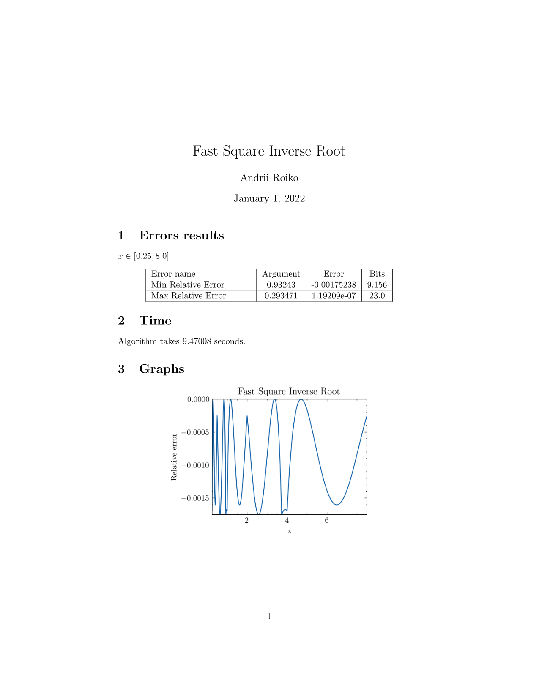

# Cpp + Python + LaTeX = Ugly reports generator :)

If you do research in numerical analysis, you often need to get absolute or relative errors of the algorithm and plot these errors. This repo can help you to create pdf-report for your algorithm in C++.

## Installation
You need to have:
```
g++ compiler
pdflatex
python3.6+ (requirements.txt)
```
## Example 
You can check a report for the famous Fast Square Inverse Root algorithm (https://github.com/id-Software/Quake-III-Arena/blob/dbe4ddb10315479fc00086f08e25d968b4b43c49/code/game/q_math.c#L546-L581).

First of all, you need to create a virtual environment and install all necessary python libraries:

```
make create_env VENV=venv
```
Then you can generate a report for relative errors of the algorithm:
```
make run VENV=venv
```

If you made all good, my little numerical analysis researcher, in your repository directory would appear ```report.pdf``` (you can check it in ```demo/report.pdf```) and it looks like this:



## TODO:
- [ ] Write good README
- [ ] Add an absolute error
- [ ] Create a better LaTeX template
- [ ] Create a .yaml file for user-friendly usage
