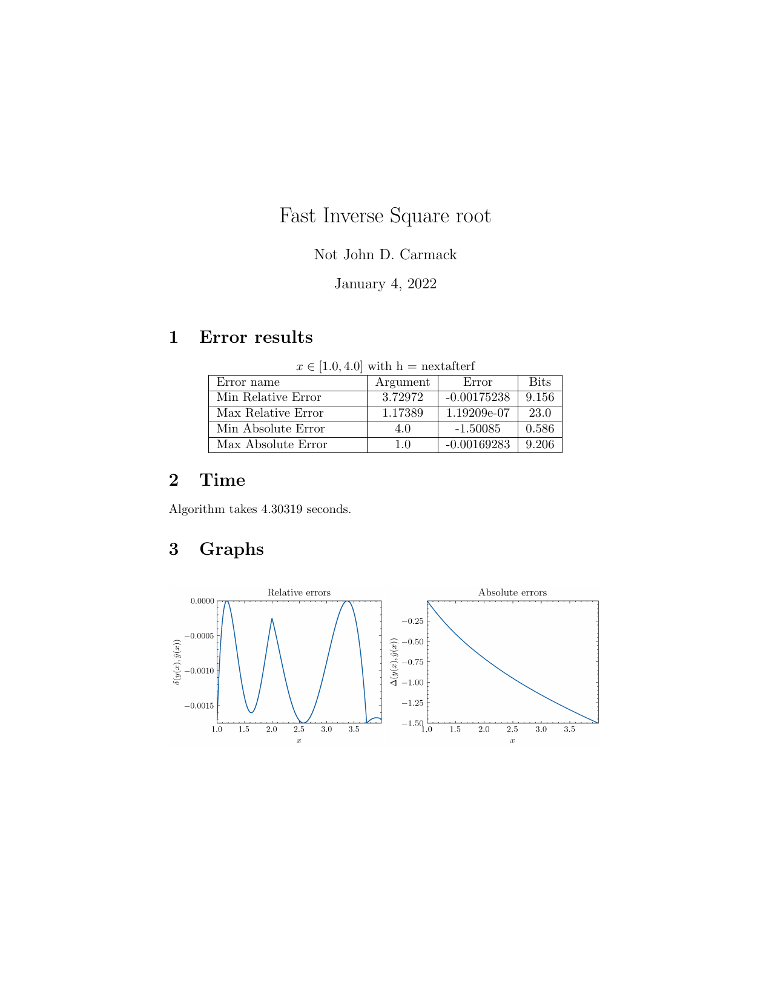
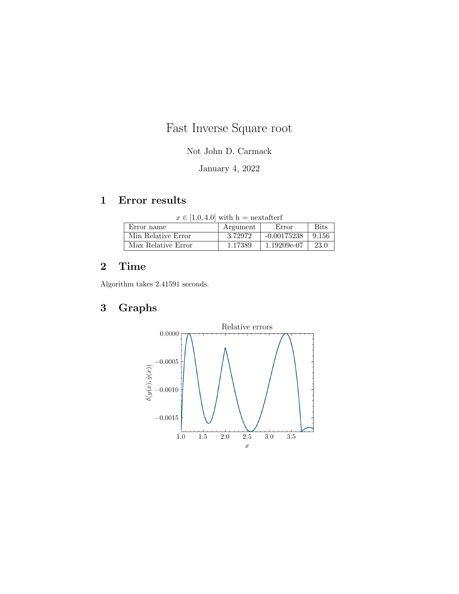

# Cpp + Python + LaTeX = Ugly reports generator :)

If you do research in numerical analysis, you often need to get absolute or relative errors of the algorithm and plot these errors. This repo can help you create a pdf report for your algorithm in C++.

## Installation
Necessary to have:
```
g++ compiler
python3.6+ (requirements.txt)
pdflatex
```
## Usage
### Pipeline
Pipeline of the report generator consists of 2 parts:
1. C++ analyzer of the algorithm (```algo_analyzer.hpp```)
2. Python script for plotting graphs, creating LaTeX template and calling ```pdflatex``` utility for pdf report.
### How to use
Firstly, you need to create a new ```.cpp``` file, write your function (now it is only a float function) inside it and then call the ```testing``` function from the ```algo_analyzer.hpp```.

Crucially to understand how to specify arguments for ```testing``` function:

```
void testing(config config, std::function<float(float)> accelerating_func, std::function<float(float)> true_func)

config is struct which defined as:
struct config
{
    std::string algoName; // your algorithm name 
    std::string author; // name of the algorithm author
    float a; // start value for analyzing the algorithm
    float b; // end value for analyzing the algorithm
    float step; // step for analyzing the algorithm, -1 if you want to analyze
    bool need_absolute_error; // if you need absolute errors
    bool need_relative_error; // if you need relative errors
    bool standard_rel_formula; // if you want to analyze relative error with formula:  your_func(x) / true_func(x) - 1
    bool modified_rel_formula; // if you want to analyze relative error with formula:  your_func(x) * true_func(x) - 1
    int pass_every_n_record; // pass every n record for plot, 1 if you want all points
};

accelerating_func - user-defined float function
true_func - actual float function
```
After defining the ```testing``` function with your arguments, you need to execute your ```.cpp``` code. It creates ```info.txt``` and ```errors.csv``` files. Then you need to execute ```csv2latex.py```. If you did everything successfully, a ```report.pdf``` file will be created.

## Example 
You can test the reports generator on the famous Fast Square Inverse Root algorithm (https://github.com/id-Software/Quake-III-Arena/blob/dbe4ddb10315479fc00086f08e25d968b4b43c49/code/game/q_math.c#L546-L581).

```example.cpp``` defined as:
```
#include "algo_analyzer.hpp"

float Q_rsqrt(float number)
{
	long i;
	float x2, y;
	const float threehalfs = 1.5F;

	x2 = number * 0.5F;
	y  = number;
	i  = * ( long * ) &y;						// evil floating point bit level hacking
	i  = 0x5f3759df - ( i >> 1 );               // what the fuck?
	y  = * ( float * ) &i;
	y  = y * ( threehalfs - ( x2 * y * y ) );   // 1st iteration
    return y;
}

int main(){
    struct config config;
    config.algoName = "Fast Inverse Square root";
    config.author = "Not John D. Carmack";
    config.a = 1.0f;
    config.b = 4.0f;
    config.step = -1.0f;
    config.need_absolute_error = true;
    config.need_relative_error = true;
    config.standard_rel_formula = false;
    config.modified_rel_formula = true;
    config.pass_every_n_record = 100;

    testing(config, Q_rsqrt, sqrt);
}
```

Create a virtual environment and install all necessary python libraries. You can do this with ```Makefile``` in the repo:

```
make create_env VENV=venv
```
Then you can generate a report of the algorithm:
```
make run VENV=venv
```

If you made all good, my little researcher, in your repository directory would appear ```report.pdf``` (you can see examples in ```demo/``` directory) and it looks like this:



Also, you can generate a report with other parameters. For example, a report with one type of error looks like this:



## TODO
- [] Test a report generator on different parameters. I assume that sometimes it can crush.
- [] Invent another pipeline instead of a cpp-file-python cringe. 